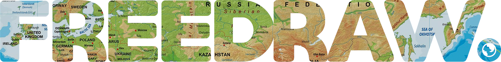
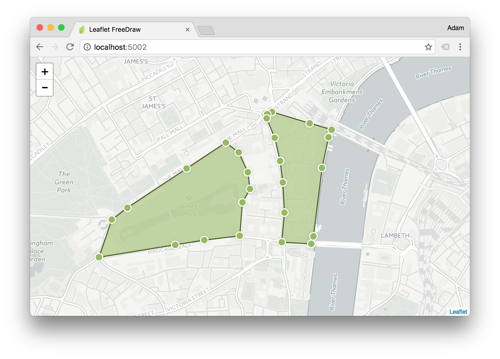

> FreeDraw allows the free-hand drawing of shapes on your Leaflet.js map layer &ndash; providing an intuitive and familiar UX for creating geospatial boundaries similar to [Zoopla](http://www.zoopla.co.uk/for-sale/map/property/london/?include_retirement_homes=true&include_shared_ownership=true&new_homes=include&q=London&results_sort=newest_listings&search_source=home&pn=1&view_type=map) and others. Included out-of-the-box is the [concaving of polygons](http://ubicomp.algoritmi.uminho.pt/local/concavehull.html), polygon merging and simplifying, as well as the ability to add edges and modify existing shapes.
> **Note:** For drawing polylines instead, try [`L.Pather`](https://github.com/Wildhoney/L.Pather).


&nbsp;

&nbsp;

&nbsp;


* **npm:** `npm i leaflet-freedraw`
* **Bower:** `bower i leaflet-freedraw`
* **JSFiddle:** https://jsfiddle.net/cb7u93hs/

## Table of Contents

1. [Browser Support](#browser-support)
2. [Getting Started](#getting-started)
  1. [Markers](#adding-markers)
  2. [Modes](#setting-modes)
  3. [Options](#passing-options)
  4. [Classes](#classes)
  5. [Methods](#bundled-methods)
  6. [Predefined Polygons](#predefined-polygons)



## Browser Support

     

## Getting Started

`FreeDraw` functions as a standard Leaflet module, meaning you initialise it and add it to your map layer via the `addLayer` function on your map instance &ndash; when you instantiate `FreeDraw` you can pass a set of [`options`](#passing-options) for behaviour customisation.

```javascript
import L from 'leaflet';
import FreeDraw from 'leaflet-freedraw';

const map = new L.Map(node);
const freeDraw = new FreeDraw();

map.addLayer(freeDraw);
```

By attaching `FreeDraw` to your map layer, an SVG node will be appended to the DOM, and mouse event listeners will be attached to the `map` instance for creating and managing the geospatial polygons.

## Adding Markers

When a user creates a polygon an event is fired on the `map` instance called `markers` which you can listen for by using the native Leaflet `on` function.

```javascript
freeDraw.on('markers', event => {
    console.log(event.latLngs);
});
```

**Note:** You can obtain the event type through the `event.eventType` field &ndash; such as `create`, `edit`, etc...

Once you have received the latitude and longitude values the next step would likely be to perform any necessary geospatial queries, and then render the relevant markers onto the map &ndash; for this you *could* use `L.Marker` and the native `addTo` method for [placing markers](http://leafletjs.com/reference-1.0.2.html#marker) on the map &ndash; however the important take-away is that `FreeDraw` doesn't concern itself with marker placement, as this is sufficiently covered by Leaflet.

## Setting Modes

By default the mode is `ALL` which means all actions can be performed on the `FreeDraw` layer &mdash; create, edit, delete, and append &mdash; you're able to modify the mode at any time by using the `mode` method, or upon instantiation by passing an object as the first argument.

```javascript
import L from 'leaflet';
import FreeDraw, { CREATE, EDIT } from 'leaflet-freedraw';

const map = new L.Map(node);
const freeDraw = new FreeDraw({
    mode: CREATE | EDIT
});
```

By passing in the `mode` as `CREATE | EDIT` you're **only** allowing the user to create and edit polygons, they are not able to append edges, nor delete them. You may use the `mode` method post-instantiation to modify the `mode` at any time &ndash; in the case below to also allow deleting of polygons.

```javascript
// Allow create, edit and delete.
freeDraw.mode(CREATE | EDIT | DELETE);

// Allow everything except create.
freeDraw.mode(ALL ^ CREATE);

// Allow nothing.
freeDraw.mode(NONE);
```

> Note: Invoking `mode` without passing a mode simply returns the current mode.

## Passing Options

All of the following options can be passed in when instantiating `FreeDraw` in the same way that we pass `mode` in the previous examples.

| Option                 | Default      | Result                               |
| ---------------------- |------------- | ------------------------------------ |
| `mode`                 | `ALL`        | Modifies the default [mode](#setting-modes). |
| `smoothFactor`         | `0.3`        | By how much to [smooth](http://leafletjs.com/reference-1.0.2.html#polyline-smoothfactor) the polygons.  |
| `elbowDistance`        | `10`         | Factor to determine when to delete or when to append an edge.  |
| `simplifyFactor`       | `1.1`        | By how much to [simplify](https://sourceforge.net/p/jsclipper/wiki/documentation/#clipperlibclippercleanpolygon) the polygon.  |
| `mergePolygons`        | `true`       | Whether to attempt merging of polygons that intersect.  |
| `concavePolygon`       | `true`       | Whether to apply the [concaving algorithm](http://ubicomp.algoritmi.uminho.pt/local/concavehull.html) to the polygons.  |
| `maximumPolygons`      | `Infinity`   | Maximum number of polygons to be added to the map layer.  |
| `notifyAfterEditExit`  | `false`      | Whether to defer `markers` event until after exiting `EDIT` mode.  |
| `leaveModeAfterCreate` | `false`      | Whether to exit `CREATE` mode after each polygon creation.  |
| `strokeWidth`          | `2`          | Size of the stroke when drawing. |

By using the options above we can tweak how `FreeDraw` functions &ndash; whilst some of the options have obvious effects, others are much more *tweak and see* based on your expected outcome &ndash; such as the subjective `simplifyFactor` and `elbowDistance` options.

## Classes

Depending on the current modes active on the map instance, the relevant classes are applied to the `map` container that you instantiated `L.Map` with &ndash; by using these class names it allows you to tailor the UX to the current mode, such as changing the `cursor` to `crosshair` when the user is allowed to create polygons.

| Class Name          | Mode         |
| ------------------- |------------- |
| `mode-none`         | `NONE`       |
| `mode-create`       | `CREATE`     |
| `mode-edit`         | `EDIT`       |
| `mode-delete`       | `DELETE`     |
| `mode-append`       | `APPEND`     |

```css
.map.mode-create {
    cursor: crosshair;
}
```

From the above example if the current mode is `CREATE | EDIT | APPEND` then the **three** class names that will be present on the `map` node will be `mode-create`, `mode-edit` and `mode-append`, allowing you to provide a better UX from within your attached stylesheet.

### Bundled Methods

With the instance of `freeDraw` there are certain methods for manipulating `FreeDraw` directly, such as creating polygon from a set of latitude and longitude values.

| Method              | Yields       | Result                                                         |
| ------------------- |------------- | -------------------------------------------------------------- |
| `create`            | `Array`      | Creates a polygon by passing an array of `LatLng`s             |
| `remove`            | `void`       | Removes a polygon that is yielded from `create`                |
| `clear`             | `void`       | Clears all polygons from the current instance                  |
| `mode`              | `Number`     | Sets and retrieves the current [`mode`](#setting-modes).               |
| `cancel`            | `void`       | Cancels the current create action &ndash; such as on escape.   |
| `size`              | `Number`     | Yields the number of polygons on the map layer.                |
| `all`               | `Array`      | Enumerate all of the current polygons for the current layer    |

When using the `create` method to create polygons from an array of latitude and longitude values, the `CREATE` mode is disregarded, which means it doesn't need to be enabled to `create` to succeed &ndash; if you would like such behaviour then you could simply assert that `CREATE` is enabled.

```javascript
import L, { LatLng } from 'leaflet';
import FreeDraw from 'leaflet-freedraw';

const map = new L.Map(node);
const freeDraw = new FreeDraw();

// Create a polygon based on the given lat/long values.
const polygons = freeDraw.create([
    new LatLng(51.50046151184328, -0.08771896362304689),
    new LatLng(51.50067523261736, -0.09175300598144533),
    new LatLng(51.50329323076107, -0.09106636047363283),
    new LatLng(51.50409462869737, -0.08763313293457033)
]);

// Remove the created polygons from the map.
polygons.forEach(polygon => freeDraw.remove(polygon));

// Alternatively you could have cleared ALL polygons.
freeDraw.clear();
```

**Note:** `create` method returns an array of polygons, as often it may yield more than one.

In the case of the `cancel` method it's often desirable to cancel the creation of the polygon when the escape key is pressed &ndash; for this you simply need to attach an event to the `document.body`.

```javascript
document.addEventListener('keydown', event => {

    // Cancel the current action when the escape key is pressed.
    event.key === 'Escape' && freeDraw.cancel();

});
```

## Predefined Polygons

You can add polygons to the map layer at any point by using the `create` method. You **must** remember to [setup `FreeDraw` through Leaflet](#getting-started), rather than instantiating `FreeDraw` without tying it to a Leaflet map instance.

```javascript
freeDraw.create([
    new L.LatLng(51.50046151184328, -0.08771896362304689),
    new L.LatLng(51.50067523261736, -0.09175300598144533),
    new L.LatLng(51.50329323076107, -0.09106636047363283),
    new L.LatLng(51.50409462869737, -0.08763313293457033)
]);
```
