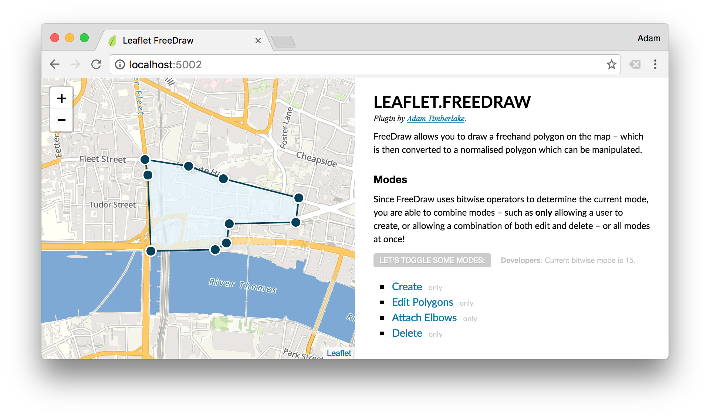

> FreeDraw allows the free-hand drawing of shapes on your Leaflet.js map layer &ndash; providing an intuitive and familiar UX for creating geospatial boundaries similar to [Zoopla](http://www.zoopla.co.uk/for-sale/map/property/london/?include_retirement_homes=true&include_shared_ownership=true&new_homes=include&q=London&results_sort=newest_listings&search_source=home&pn=1&view_type=map) and others. Included out-of-the-box is the [concaving of polygons](http://ubicomp.algoritmi.uminho.pt/local/concavehull.html), polygon merging and simplifying, as well as the ability to add edges and modify existing shapes.
> **Note:** For drawing polylines instead, try [`L.Pather`](https://github.com/Wildhoney/L.Pather).


&nbsp;

&nbsp;

&nbsp;


* **npm:** `npm i leaflet.freedraw`
* **Bower:** `bower i leaflet.freedraw`



## Getting Started

`FreeDraw` functions as a standard Leaflet module, meaning you initialise it and add it to your map layer via the `addLayer` function on your map instance &ndash; when you instantiate `FreeDraw` you can pass a set of [`options`](#options) for behaviour customisation.

```javascript
import L from 'leaflet';
import FreeDraw from 'leaflet-freedraw';

const map = new L.Map(node);
const freeDraw = new FreeDraw();
```

By attaching `FreeDraw` to your map layer, an SVG node will be appended to the DOM, and mouse event listeners will be attached to the `map` instance for creating and managing the geospatial polygons.

### Markers

When a user creates a polygon an event is fired on the `map` instance called `markers` which you can listen for by using the native Leaflet `on` function.

```javascript
map.on('markers', event => {
    console.log(event.latLngs);
});
```

Once you have received the latitude and longitude values the next step would likely be to perform any necessary geospatial queries, and then render the relevant markers onto the map &ndash; for this you *could* use `L.Marker` and the native `addTo` method for [placing markers](http://leafletjs.com/reference-1.0.2.html#marker) on the map &ndash; however the important take-away is that `FreeDraw` doesn't concern itself with marker placement, as this is sufficiently covered by Leaflet.

### Modes

By default the mode is `ALL` which means all actions can be performed on the `FreeDraw` layer &mdash; create, edit, delete, and append &mdash; you're able to modify the mode at any time by using the `mode` method, or upon instantiation by passing an object as the first argument.

```javascript
import L from 'leaflet';
import FreeDraw, { CREATE, EDIT, DELETE } from 'leaflet-freedraw';

const map = new L.Map(node);
const freeDraw = new FreeDraw({
    mode: CREATE | EDIT
});
```

By passing in the `mode` as `CREATE | EDIT` you're **only** allowing the user to create and edit polygons, they are not able to append edges, nor delete them. You may use the `mode` method post-instantiation to modify the `mode` at any time &ndash; in the case below to also allow deleting of polygons.

```javascript
import { CREATE, EDIT, DELETE } from 'leaflet-freedraw';

// ...

freeDraw.mode(CREATE | EDIT | DELETE);
```

> Note: Invoking `mode` without passing a mode simply returns the current mode.

### Options

All of the following options can be passed in when instantiating `FreeDraw` in the same way that we pass `mode` in the previous examples.

| Option              | Default      | Result                               |
| ------------------- |------------- | ------------------------------------ |
| `mode`              | `ALL`        | Modifies the default [mode](#modes). |
| `smoothFactor`      | `0.3`        | By how much to [smooth](http://leafletjs.com/reference-1.0.2.html#polyline-smoothfactor) the polygons.  |
